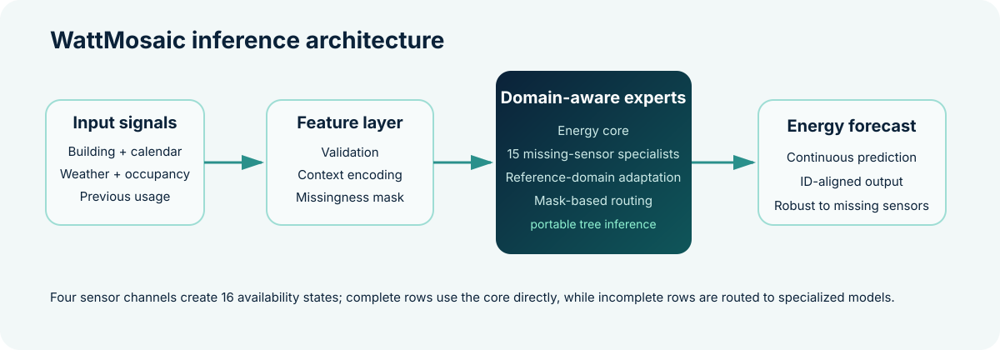

<p align="center">
  
</p>

<p align="center">
  <a href="notebooks/WattMosaic.ipynb"></a>
  
  
</p>

<p align="center">
  <b>Forecasting campus energy demand when real-world sensor data is incomplete.</b>
</p>

---

## ✨ Overview

**WattMosaic** is a regression pipeline for forecasting campus facility energy consumption from historical usage, occupancy, environmental conditions, building context, and calendar signals.

The project was originally developed for **NTU Datathon / Deep Learning Week 2026 — Track 1: Smart Campus Analytics**. The central modelling challenge was not simply regression accuracy: the public test distribution contained **different combinations of missing sensor readings**, so a single generic imputation strategy left performance on the table.

WattMosaic addresses that with a **domain-aware mixture of specialists**. Instead of forcing every incomplete row through the same model, it detects which of the four sensor channels are unavailable and routes the observation to a specialist trained for that missingness pattern.

> **Project-reported public leaderboard RMSE: `3.17093`**

The public release is a technical walkthrough. Its executable code covers four-sensor missingness masks, simplified core/specialist routing and a synthetic check of all 16 patterns. The full training pipeline, fitted trees, portable tree export and original evaluation artifacts are not included.

## 🧠 Why WattMosaic?

The four sensor channels — **temperature, humidity, occupancy, and previous usage** — create 16 possible availability states. WattMosaic uses the full energy model when all sensors are present and specialized models when one or more sensors are missing.

<p align="center">
  
</p>

### Core ideas

- **Mask-aware routing** — recognizes the exact missing-sensor pattern for each row.
- **Domain-aware specialists** — adapts missing-sensor relationships using unlabeled reference features while never using hidden energy labels.
- **Strong structural baseline** — preserves building, calendar, weather, occupancy, and historical-usage relationships.
- **Prediction-oriented missing-data handling** — optimizes downstream energy forecasts rather than treating imputation accuracy as the end goal.
- **Portable inference, as described in project notes** — plain Python tree export was used for the fixed event runtime; that implementation is excluded from this release.
- **Submission validation, as described in project notes** — ID order, finite values and schema were checked in the event workspace; those checks and predictions are excluded.

## 📊 Results

| Evaluation | RMSE | MAE | R² |
|---|---:|---:|---:|
| Development audit — natural missingness | **3.0229** | **2.3810** | **0.9732** |
| Development audit — test-like joint missingness | **3.2143** | **2.5070** | **0.9696** |
| **Hackathon public leaderboard** | **3.17093** | — | — |

These historical values come from the project's notes. No independent leaderboard record, trained weights or evaluation data are included, so the scores cannot be independently reproduced from this release. Development and leaderboard results refer to different observations. Running the notebook displays this table; it does not calculate forecast metrics.

## 🧩 Reported modelling pipeline

This is the conceptual approach described by the project notes, rather than a map of a complete training implementation in this repository.

```text
Raw campus telemetry
        │
        ├── building + building type
        ├── hour / weekday / month
        ├── temperature + humidity
        ├── occupancy
        └── previous energy usage
        │
        ▼
Validation + deterministic feature construction
        │
        ▼
Missing-sensor mask (4 sensors → 16 states)
        │
        ├── complete row ─────────────► energy core
        │
        └── incomplete row ───────────► mask-specific domain-aware specialist
                                         │
                                         ▼
                               combined energy forecast
```

## 📁 Repository structure

```text
WattMosaic/
├── assets/
│   ├── architecture.svg
│   └── wattmosaic-banner.svg
├── notebooks/
│   └── WattMosaic.ipynb
├── .gitignore
├── LICENSE
├── README.md
├── requirements.txt          # archival event environment
├── requirements-smoke.txt    # public checks entrypoint
├── checks/requirements.txt   # current smoke dependencies
├── scripts/check_notebook.py
└── tests/test_public_routing.py
```

Only public-facing project files are included. Competition datasets, serialized model weights, generated predictions, leaderboard-probing artifacts, intermediate experiment rounds, and submission-only files are intentionally excluded.

## 🚀 Explore the notebook

The notebook contains the missingness-mask function, a simplified routing function, a data-free example, the reported metrics table and archived runtime notes:

**[Open `notebooks/WattMosaic.ipynb`](notebooks/WattMosaic.ipynb)**

The original competition data is **not redistributed** because the provided materials did not explicitly grant public redistribution rights. No dataset or trained model is needed for the public checks, and this notebook has no optional dataset-loading or training path.

## 🛠️ Environment

Use Python 3.12 and the separate current smoke environment to run the public notebook:

```bash
python -m venv .venv
# Windows: .venv\Scripts\activate
# macOS/Linux: source .venv/bin/activate
python -m pip install -r requirements-smoke.txt
python -m pytest -q
python scripts/check_notebook.py
```

`requirements.txt` preserves the **archival event runtime** (NumPy, pandas, scikit-learn, LightGBM, XGBoost, SciPy, Matplotlib, Seaborn and Joblib). It is historical documentation, not the maintained smoke environment or a production deployment recommendation. The trained `model.pkl` is not included.

[Public notebook CI](https://github.com/C-X1an/WattMosaic/actions) executes the walkthrough top-to-bottom and tests the actual notebook functions against synthetic inputs: all 16 masks, repeated patterns, row order, core/specialist selection, nonnegative clipping and empty inputs. It audits only the current smoke dependencies. These checks do not establish trained-model accuracy, domain adaptation or leaderboard performance.

## 🔬 What I learned

This project reinforced several practical ML lessons:

1. **Missingness is part of the data-generating process.** Treating every missing value identically can be worse than modelling different failure modes explicitly.
2. **Better imputation is not automatically better prediction.** The useful objective is downstream forecast error.
3. **Validation must resemble deployment.** Random CV alone can miss train/test differences in sensor availability.
4. **Complexity only earns its place when it transfers.** Several larger boosted and ensemble alternatives were rejected when they failed to improve robust validation or leaderboard performance.
5. **Reproducibility matters under deadline pressure.** Runtime pinning, portable model export, and output-schema checks became part of the solution—not afterthoughts.

## 🏁 Hackathon context

WattMosaic was built for **NTU Datathon / Deep Learning Week 2026**, Track 1 — **Sustainability / Smart Campus Analytics**. The task was to predict a campus facility's continuous energy consumption from historical usage, environmental conditions, building information, occupancy, and time-based patterns.

The repository is a cleaned portfolio release of the final project rather than a dump of the competition workspace.

## 📄 License

Released under the **MIT License**. See [`LICENSE`](LICENSE).

---

<p align="center">
  Built with Python, careful validation, and far too many experiments on missing sensors ⚡
</p>
